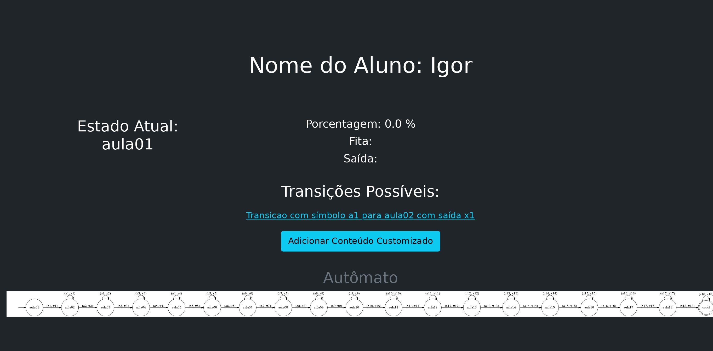

# Gerenciador de Conteúdo da Matéria LFA Baseado em Autômato Finito com Saída

O estudante pode gerênciar seu conteúdo no decorrer da matéria linguagens formais e autômatos.

## Pré-Requisitos

O sistema operacional usado foi UBUNTU 20.04 e a versão do python foi 3.8.5.

* graphviz
	```SHELL
	sudo apt-get install graphviz
	```

* Pacotes do python:
	- Usar o comando:
	```SHELL
	pip3 install -r requirements.txt
	``` 

## Para Executar

Versão para terminal

```SHELL
python3 main.py
```

Versão web (em desenvolvimento)

```SHELL
flask run
```

## Estrutura do Sistema

Estruturas das "entidadas" envolvolvidas na implementação.

* Estrutura de um Autômato com saída
	* sigma: alfabeto
	* Q: conjunto de estados
	* q0: estado inicial
	* F: conjunto de estados finais
	* delta: conjunto de simbolos de saída
	* funcao_programa: que determina as transições dos estados, nesse caso ela vai ficar definida nos estados e suas transições.

* Estrutura de um Estado:
	* label: label do estado
	* transicoes: um map contendo as transicoes do estado, com a key sendo o símbolo, e listas como intem do map, essa lista é do tipo [proximoEstado, saidaDadaPelaTransicao]

* Estrutura de um Estudante:

	Estudante servirá como o jogador do autômato, com principal objetivo de ser a instância do autômato, guardando as informações de:

    * estado corrente: estado em que o estudante se encontra
	* fita:
	* saida:


## ScreenShots


